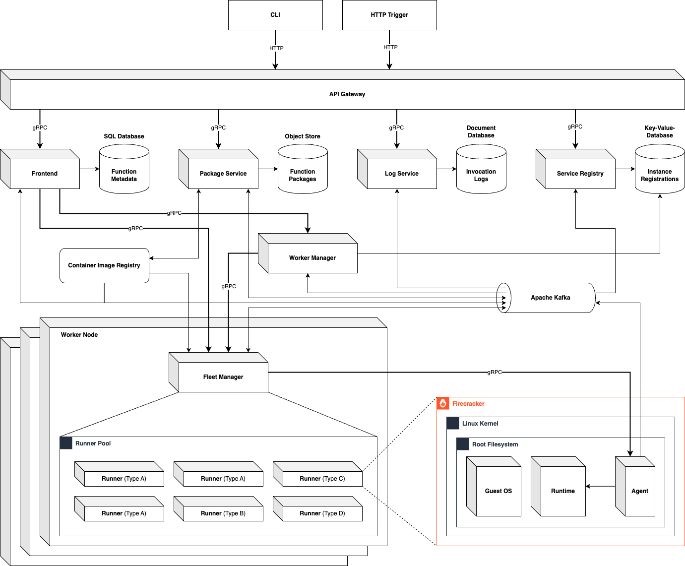

# System Design and Architecture

## System Architecture

The following image shows the architecture of the Apollo system.

<picture>
   
</picture>

## System components

The Apollo FaaS platform represents a distributed system in the microservice architecture. The components are separated into core- and feature components. 

### Core components

The core components of Apollo include all services the are necessary for the system to operate.

- **Apollo Agent**

   Apollo uses Firecracker micro vms under the hood to ensure a fully isolated execution environment for the function workload. The component that contains the micro vm and all associated components is called the runner. These other components include the runtime and the agent, which are executed within the micro vm. The agent establishes the connection between the Fleet Manager and the runner and is responsible for processing workloads (and storing logs).

- **Apollo Fleet Manager**

   To enable dynamic scaling, Apollo is able to use multiple Worker nodes to place Runners on. The components the manages the placement of the runners inside a worker node is called Fleet Manager. This component is responsible for the runner lifecycle and the provision of necessary resources for the runners. This includes starting, stopping, monitoring and reusing runners after a workload has been executed. In addition, corresponding resources such as the root file systems for the micro vms including the installed runtime are downloaded from the container image registry and extracted to a fully-fledged micro vm root file system, so that the runners only need to integrate this to start. This enables the runner to react quickly, even if no warm instance is available. A warm instance means a runner that has already been used and therefore is started, waiting for the next workload until it reaches its time to live. To keep track of the runners within a worker node, the Fleet Manager uses a runner pool which contains all active runner instances. These are regularly checked for their health so that unreliable runners can be eliminated directly without causing downtime.

- **Apollo Worker Manager**

   As a central component, the Worker Manager is responsible for managing the various worker nodes. This component has an overview of the worker nodes active in the system and makes decisions about the placement of functions and workloads. Generally speaking, the worker manager acts as an intermediary between the fleet managers and the frontends. Monitoring the health of the Fleet Managers, or rather Worker Nodes, is handled by the Service Registry, which also serves as the first point of contact for registering a Fleet Manager in the system. The Service Registry provides the Worker Manager with the metrics transmitted by the Fleet Managers so that he can make placement decisions. As soon as a function has been placed within one or more worker nodes, the Worker Manager saves this route in its memory for future requests. If workload requests now arrive, the Worker Manager can quickly find a corresponding route to a Fleet Manager and report it back to the requesting front end. This can then go directly to the corresponding Fleet Manager with the workload.

- **Apollo Frontend**

   After the API gateway, the front end is the first component of the internal system. This component handles the execution of user requests. These requests include creating, updating and executing functions and retrieving logs. In addition, the frontend also manages all database entries for the functions in order to enrich the corresponding requests directly with the necessary information and thus provide the following components directly with all the information they need.

- **Apollo API Gateway**

   The API gateway serves as an entry point and interface between the users and the internal system. It receives HTTP requests via a REST API, queries the network address of a suitable service instance from the service registry and forwards the request converted into gRPC to the instance. In future versions, the API gateway will also be used to control access to resources.

- **Apollo Service Registry**

   The Service Registry is responsible for managing the various service instances (and Fleet Managers). The instances register with this component and receive a lease for a certain period of time. This is extended as soon as a heartbeat message arrives at the Service Registry via asynchronous messaging. If no such message with the current metrics of the instance arrives at the service registry for a long time, this instance is considered dead and loses the lease. This means that future requests will no longer be forwarded to the instance unless it registers again and receives a lease. The service registry contains a mechanism for automatic load balancing between the available instances of a service type by evaluating metrics such as CPU and RAM usage. The instance with the lowest utilization is rated highest and selected accordingly for future requests until the rating changes again due to changing metrics.

- **Apollo Package Service**

   The package service is responsible for creating and managing the function code. As soon as a user creates a function or updates its code, it is uploaded directly to the object storage as a ZIP archive. The package service is then tasked with downloading and unpacking the archive. The code is then copied into a container image together with other files, depending on the runtime. This container image is then uploaded to the internal container image registry so that it can be downloaded by the fleet managers and extracted to a file system. 

   Note: Container images are used for the distribution of all types of filesystems inside of the system, as they are built in layers. This means, only the new or not yet downloaded layers must be downloaded which decreases the provision time of a function significantly.

- **Apollo CLI**

   The CLI is the tool for operating the system. It can be used, for example, to extract all types of container images for the system build to a file system and upload them to the internal registry. It is also possible to create and update functions and execute them with a workload. Further functions are planned and will be implemented in the future.

### Feature components

- **Apollo Log Service**

   The log service is responsible for the storage and supply of all logs. These include internal logs from the Firecracker processes or logs about the execution of a function that can be viewed by the user. It is planned to replace this component with a global log collector in the future and to enable evaluation using appropriate tools.

